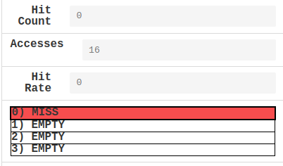
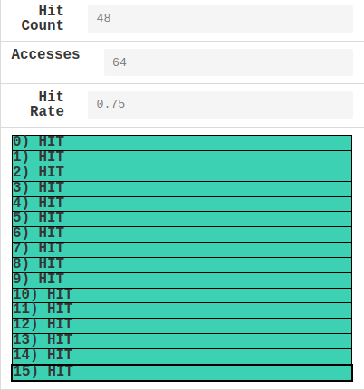

# EX1

## Scenario 1:

1. **Block Size (Bytes):** 8, **Step Size:** 8 -> step size in bytes = 32 > block size
2. 还是0。因为永远在miss

3. 一个 cache block 8 bytes，如果 step size 设定为1，那么一次走4 bypes，刚好一次 miss 一次 hit，hit rate达到最大0.5

## Scenario 2:

1. **Block Size (Bytes):** 16，**Step Size:** 2 -> step size in bytes = 8，16/8=2

   每个最inner loop 会access同一个地址两次（load and write）
   那么每两个inner loop，miss(然后存进cache)，hit(因为访问的就是刚刚存进cache的地址)

   下一个loop: hit(因为16/8=2 刚刚已经存进去了)，hit（同理）

2. hit rate $\to$ 1。永远只会有第一个outer loop中的16次miss，后面的循环里全部都是hit

3. number of blocks = 8 or 4 or 2 or 1. 
   Cache Blocking Techniques

## Scenario 3:

1. max=0.5
   前8次access注定miss 8*4>16
   后8次access如果恰好每次random到的place都是上一个循环因为miss而存到cache里的place，那么就是hit
   理论上best case 8 hits, worse case 0 hit
    the range of its hit rate: $[0, 0.5]$​

2. Block Size (Bytes) = 64 (第一个循环先是一个miss一个hit，第二个循环就全是hit) hit rate = 0.75

   或者其他 $\ge 64$ 的power of 2,hit rate会继续上升

   或者把number of blocks改成1

   

lscpu

小核关了

超线程关了（仅竞速pj期间）
