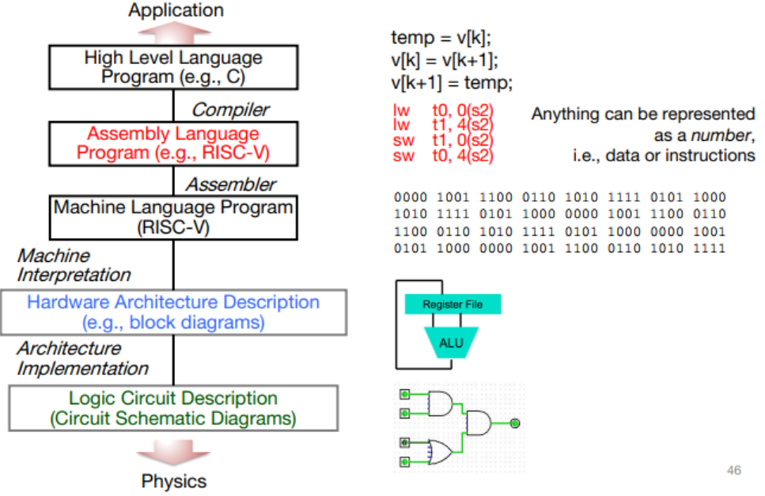
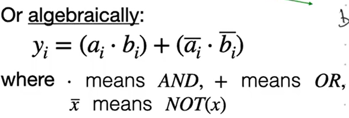
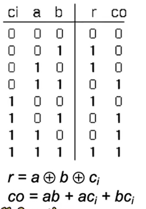
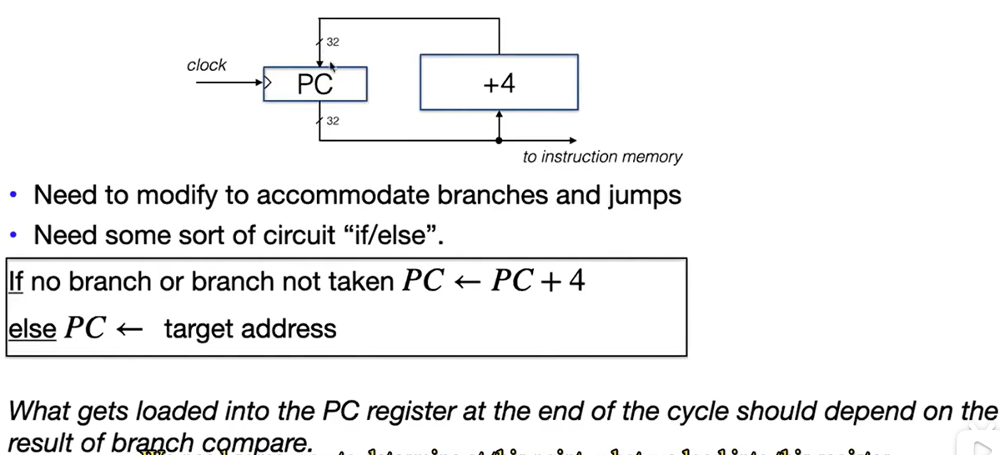
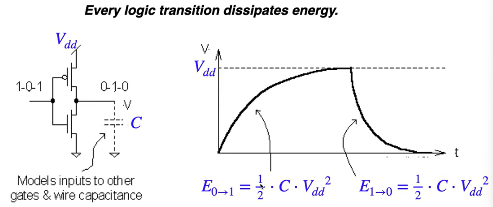

# Great Ideas in Computer Architecture

1. Abstraction

   

2. Moore’ s law? 每年两倍，但近年速度在减缓

3. Amdahl’ s law: make common case faster

4. Principle of Locality/ Memory Hierarchy 越远的内存，获取速度越慢，用来存更大量的信息

5. Parallelism/Pipeline  

6. Performance Measurement & Improvement  

7. Dependability via Redundancy  使用冗余的计算和内存，提高输出的准确度


# Number Representations

## Signed Integers: 2’ s complement


## Floating-piont Numbers: IEEE

> [IEEE Standard 754 Floating Point Numbers - GeeksforGeeks](https://www.geeksforgeeks.org/ieee-standard-754-floating-point-numbers/?ref=gcse)


8 bits exponent, bias = 127, 能表示$2^{-127}$ ~ $2^{128}$

mantissa隐含前导0

| EXPONENT | MANTISA |       VALUE        |
| :------: | :-----: | :----------------: |
|    0     |    0    |      exact 0       |
|   255    |    0    |      Infinity      |
|    0     |  not 0  |    denormalised    |
|   255    |  not 0  | Not a number (NAN) |


|   Denormalized   |          Normalized           |     Approximate Decimal      |                                                   |
| :--------------: | :---------------------------: | :--------------------------: | ------------------------------------------------- |
| Single Precision |  ± 2-149 to (1 – 2-23)×2-126  |  ± 2-126 to (2 – 2-23)×2127  | ± approximately 10-44.85 to approximately 1038.53 |
| Double Precision | ± 2-1074 to (1 – 2-52)×2-1022 | ± 2-1022 to (2 – 2-52)×21023 | ± approximately 10-323.3 to approximately 10308.3 |

---

# C


`&`: 按位 and

`&&`: bool logic

---

```cpp
void f(void){
	int *ptr;
	*ptr = 5;
}
```

`ptr` 未初始化，undefined behavior

#### Array/Pointer Duality

```cpp
char string1[] = "abc";
char *string2 = "abc";
```

- CAN modify string1[\*]    (stack)

- CANNOT modify string2[\*]    (static)

- CAN access string2 by string2[\*]

```cpp
int arr[] = { 3, 5, 6, 7, 9 };
int *p = arr;
int (*p1)[5] = &arr;	// 指向五维数组的指针
int *p2[5];				// 一个数组，其中每个元素都是一个指针
int (*p)(void);			// 指向某个函数的指针
int (*func_arr[5])(float x);	// 函数声明
```

```cpp
void inc_ptr(int *p)
{p = p + 1;}
int A[3] = {50, 60, 70};
int *q = A;
inc_ptr( q);
printf( "q = %d\n",*q); // *q = 50
```

Use pointer to a pointer

```cpp
void inc_ptr(int **h)
{*h = *h + 1;}
int A[3] = {50, 60, 70};
int *q = A;
inc_ptr(&q);
printf(“*q = %d\n”, *q);  // *q = 60
```

### Arguments in `main()`

编译得到`.out`后，可以通过运行时在命令行输入，来向main函数传参


---

### sizeof() ==Operator==

sizeof(type) returns **number of bytes** in object

- sizeof(char)==1
- Can take sizeof(variable) , or sizeof(type)

### Pointer arithmetic

内存对齐 alignment

C defines that one element past end of array must bea valid address, i.e., not causing an error

---
### Memory Management
When a C program is run, there are three important memory areas allocated:

1. **Static**
   - Variables declared once per program, cease to existonly after execution completes 
   - e.g., C globals

2. **Heap**
   - Variables declared dynamically via malloc/calloc/realloc

3. **Stack**
   - Space to be used by procedure during execution; thisis where we can save register values AND local variables


---
# RISV-V

## Function Calls

function call前后，the callee saved registers (sp, s0-s7) must be returned unchanges

When calling a function, store the address where we want to jump back after finishing the function to the register `ra`.

However, when a recursion or a function inside a function exists, such method  won’t work well, since 

1. the **address** in `ra` to which we want to jump back has been **overwritten** by the jump back address of the inside function. (At one time, only one address is available. )
2. The **return values** are similarly **overwritten**.

Therefore, we need a **stack** to store the address for function calls. 

Use a register `sp` which always points to the last used space in the stack.

Each time, store or load the address on the stack into `ra`.

### Calling Convention

> see General Resources/calling conventions for detail

unconditional jump

| Register Name(s) | Usage                                                        | Saver  |
| ---------------- | ------------------------------------------------------------ | ------ |
| x0               | always holds 0                                               | NA     |
| ra               | holds the return address                                     | caller |
| sp               | address of the boundary of stack                             | callee |
| t0-t6            | Holds temporary values that do not persist after function calls | caller |
| s0-s11           | Holds values that persist after function calls               | callee |
| a0-a1            | Holds the first two arguments to the function or the return values | caller |

***Callee-saved***: 调用前后，值不发生变化

***Caller-saved***: 调用前后，值可以发生变化

#### Function call uses: (conditional jumps)

##### `jal ra label` (`jal label`) : 

jump to label (imm+PC) and store P C + 4 in `ra`, which is the address of the next instruction to run after the function call

(PC是当前这行的地址，每行汇编指令的长度是32bits = 4 bytes)

`jal` 的跳转目标是label, 会转换成当前地址(PC)加上一个偏移量

`jal` jumps to a label (which is translated into an immediate by the assembler)

#####  `jalr ra rd imm` (`jalr rd`, imm = 0) :

 similar except it sets the PC value to rd + imm.

`jalr` 的跳转目标是由寄存器中的地址决定

`jalr` jumps to an address stored in a register, which is set at runtime

`jalr`通常用于函数的返回，回到caller的地方

#### Loop uses: (uncondition jumps)

`jal x0 label` (`j label`) : attempt to store the return value in `x0`, but nothing wiil be stored since `x0` is always 0. So there is not a location to return to.

`jalr x0 rd imm` (`jr rd`, imm = 0)


> Example
> 

> Another example
>
> 
>
> 
>
> 
>
> 

---

## Instruction Formats

All instructions and data are stored in memory and has a memory address.

Programs are distributed in binary form. 

- A program on RISV can’t be transplanted to any other such as ARM or x86. (不兼容其他架构)
- But new machines in the same family is able to run the old instructions. (兼容旧版)

For simplicity, very instruction is of the same **word** length. (**32-bit instruction word**)

Divide 32-bit instruction word into 6 basic **fields**:

- **R-format** for register-register arithmetic/logical operations

- **I-format** for register-immediate ALU operations and loads

- **S-format** for stores

- **B-format** for branches

- **U-format** for 20-bit upper immediate instructions

- **J-format** for jumps

### R-format

register-register arithmetic/logical operations


 为什么把它拆成两个funct7 funct3 而不是一个17-bit的整个funct?


> Example
>
> 

****

---

### I-format

register-immediate ALU operations and loads

如果还是像R-format那样的 5-bit field 只能最多表示到31的immediate

因此，将function7的部分也用来表示immediate


> example
>
> 


####  Load instructions are also I-type


> 


---

### S-format

stores


> 


---

### **B-format**

conditional branches


Branches typically used for loops, and loops are generally small (< 50 instruction).

Therefore, we can use the immediate field as the offset (2’ s complement)

 

每次decode的时候把immediate左移一位，得到13位的immediate。因为这样得到的最右一位一定是0，所以没必要存

因为offset最少是0（就是在自己这行不动）接下来就是跳转到下一行。一行instruction 32 bit = 4 bytes，所以至少是以4为单位的跳转offset。那么存offset的时候其实有两位是没必要的，可以后续直接通过左移变回真正的offset。理论上可以少两个bit,但是为了内存对齐只减少一个Bit，是这样吗？

> 把我的话喂给gpt翻译了一下：
>
> 你提到的这种优化方法是常见的指令集架构中的一种优化手段，可以减少指令编码中的冗余位，提高指令编码的效率。
>
> 具体来说，对于立即数（immediate）字段，如果它是一个相对于当前指令地址的偏移量，而且这个偏移量是以指令对齐单位（通常是4字节）为单位的，那么最低的一位可以被视为冗余的，因为它永远是0。
>
> 同样地，对于跳转偏移量（offset），如果它是以指令对齐单位为单位的，并且在解码过程中将其左移一位以获得更多的位数，则最低的一位也是冗余的，因为它永远是0。因此，在存储跳转偏移量时，可以省略这个最低位，而在解码时可以在内部将偏移量左移一位。
>
> 对于立即数（immediate）字段来说，如果我们将其左移一位以得到13位的立即数，则确实最右边的一位一定是 0。这意味着在存储立即数时，可以省略这个最右边的一位。因此，冗余的位数是一位。
>
> 而对于跳转偏移量（offset）来说，如果我们以指令对齐单位（通常是4字节）为单位来存储偏移量，则最低的一位也是冗余的，因为它永远是0。这一点与立即数字段类似。所以，对于以4字节为单位的偏移量，冗余的位数也是一位。

> Example
>
> 
>
> 


- If moving all the code block, offset doesn’t change, so no problems.

- But if modify individual lines of code, offset changes, then the value in branch immediate field should change.

如果出现了跳转距离太远的情况：编译器自动改变条件


---

### U-format

20-bit upper immediate instructions


---

###  J-format

> see more in function calls part in this note

unconditional jumps


no need for rs1, rs2 storage 

-> larger space to store immediate (20 bits offset) 

-> ability to jump to further locations than branches


# CALL


compiler, assembler, linker, loader


**Interpreter**: Directly executes a program in the source language

- e.g. Python 

**Translator**: Converts a program from the source language to an equivalent program in another language

- e.g. gcc

**Compiler**: 

- input high-level language code (e.g., c code `foo.c`)
- output assembly language code (e.g., RISC-V code `foo.s`)

**Assembler**: 

- input assembly language code (e.g., RISC-V code `foo.s`)
- output object code, information tables (machine language `foo.o`)

### Assembler Directives

Give directions to assembler, but do not produce machine instructions

在汇编语言中用来控制汇编器行为的特殊指令。它们并不是真正的机器指令，而是用于指导汇编器在汇编过程中执行特定操作的命令。

`.text`: Subsequent items put in user text segment (machine code) 定义代码段，用于存储程序的指令代码。

`.data`: Subsequent items put in user data segment (binary rep of data in source file) 定义数据段，用于存储程序中的静态数据。

`.globl sym`: declares sym global and can be referenced from otherfiles

`.string str`: Store the string str in memory and null-terminate it

`.word w1...wn`: Store the n 32-bit quantities in successive memory

### Pseudo-instruction Replacement


### Tail

确定stack的大小，避免无止境地增长

## Assembler: Produce Machine Language

1. Find all labels, replace pseudo-instructions with real ones.

2. Use label positions to do the binary for the branches. (确定offset)

3. 在自己file内部的jump可以确定address, 但是有些文件外部的地址是位置的（可能直到运行时才能知道）

   -> **create 2 tables** 

   1. ***Relocation Table***（重定位表）：
      - 重定位表是链接器中用来存储目标文件中需要重定位的位置和对应的重定位信息的数据结构。
      - 在编译器生成目标文件时，对于一些跳转指令、全局变量等，由于其地址在编译期间无法确定，因此编译器会将这些位置标记为需要重定位的位置，并在目标文件中生成相应的重定位记录。
      - 链接器在链接过程中会根据重定位表中的信息，对目标文件中的需要重定位的位置进行修正，将其指向正确的地址，以保证程序的正确执行。

   2. ***Object/symbol Table***（对象表）：
      - 对象表是链接器中用来存储目标文件中各种符号信息的数据结构，包括全局变量、函数、常量等。
      - 在编译器生成目标文件时，会将源代码中定义的各种符号信息存储在目标文件的对象表中，并且记录其属性、地址、大小等信息。
      - 链接器在链接过程中会使用对象表来进行符号解析、符号冲突解决、符号重定位等操作，以便正确地将各个目标文件组合成最终的可执行文件或共享库。

## Linker

把多个文件link成一个`a.out`

当修改了其中一个文件，只需要对这个文件重新编译，再重新link,而无需重新编译整个（所有其他的）文件。

1. Take text segment from each .o file and put them
    together
2. Take data segment from each .o file, put them together, and concatenate this onto end of text segments
3. Resolve references
   - Go through Relocation Table, handle each entry
   - That is, fill in all ***absolute addresses***

### 3 types of addresses


## Loader

In reality, **loader** is the operating system (OS).


---

## Static vs. Dynamically Linked Libraries

### Static


现代，通常linker和loader同时工作，有一个 linker at runtime links in dynamic libraries

### Dynamic

#### Advantages

- smaller program, less disk space, less time to send

- if 2 programs share a library, less memory to execute the 2 programs.
- safer
- when a library gets upgrade, any file that uses this library dynamically gets upgrade

#### Disadvantages

- At runtime, there’s time overhead to do link
- messed up dependency, “*Linux Containers*”


## Integer Multiplication


## Integer Division


---

# Digital Circuits and systems

> 同步数字系统（Synchronous Digital Systems）是一种数字系统，其中所有的操作都在时钟信号的控制下进行。在同步数字系统中，所有的操作都在离散的时钟周期内同步进行，每个时钟周期被划分为若干个时钟周期。这种时钟驱动的方式使得系统的行为更加可预测和可控。

##### ***Asynchronous Digital Systems***

> 异步数字系统（Asynchronous Digital Systems）是一种数字系统，其中各个组件的操作不受中央时钟信号的控制，而是根据数据准备就绪或其他事件的发生来触发操作。在异步数字系统中，不同组件之间的通信和数据传输是通过信号传输的方式来实现的，而不是通过中央时钟信号的同步。

更灵活，低功耗，but harder to design & debug

## Binary Representation

用**电压**来表示0和1（高压1，低压0）


一个bit需要用一根电线表示，so one byte requires 8 wires

Binary representation provides ***reliability*** – good noise immunity.

可能有外界噪声的影响，binary 保证了即使输入并不是一个准确的值，而是在再生干扰后的一个区间内也能正确读出0或者1


## Logic Gates

2个输入，理论上可以有$2^4$种逻辑门。但实际上我们只会常用其中的几种 AND OR NOT

把 logic gate 视为 function

### example for checking if equal

>
> 
>
> 
>
> 逻辑：NXOR
>
> | a    | b    | y    |
> | ---- | ---- | ---- |
> | 0    | 0    | 1    |
> | 0    | 1    | 0    |
> | 1    | 0    | 0    |
> | 1    | 1    | 1    |
>
> 
>
> 
>
> 但是不可能直接and 32个：通过每次and两个
>
> 总共 $\log_2 32 = 5$ 层
>
> 


1. 取真值表里为1的。全部相加后化简
2. Karnauph 取整块为1的。相加

###  Example of Adder

> 
>
> 
>
> 都需要多一位的carry out
>
> 而如果照这样做 32 bit 的逻辑门，真值表实在是太大了
>
> -> break down into sub-functions
>
> 竖式加法，每一位都有一个 carry (carry-in, carry-out)
>
> 
>
> 
>
> 但其实这种full adder 虽然方法简单，但是由于一定要等到前面的全都先算完以后才能算后面的，当数位较大 e.g. 64 bits 的时候，速度就会很慢
>
> #### full adder 的逻辑门实现：
>
> 左右是两种实现方式（能否允许3输入的逻辑门），因为真值表唯一，但是对同一个真值表的bool equation不唯一
>
> 

利用full adder的逻辑门完成subtractor

$A - B = A +(-B)$

**negate B in 2’ s complement rep (invert bits and add 1)**

将 XOR 视为 inverter: 输入`x` 表示是否需要invert, 输入 `y` 表示 invert 的对象

Truth table of XOR:

| b-in | SUB  | b-out |
| ---- | ---- | ----- |
| 0    | 0    | 0     |
| 0    | 1    | 1     |
| 1    | 0    | 1     |
| 1    | 1    | 0     |

When **SUB** = 0, no invert;

When **SUB** = 1, invert.

- 如果是做subtraction, 输入`x = 1`，控制invert bits，同时作为 carry-in = 1 输入第一个full adder

- 如果是add，输入`x = 0`


用最后一位的carry-in carry-out 检测是否有 overflow

## Memory/State Elements

数字逻辑电路中常见的两种基本构建块

1. ***Combination Logic Blocks***：输出仅取决于当前的输入
2. ***State Elements***：具有内部存储状态，其输出不仅取决于当前输入，还取决于内部存储的状态


## Sequence circuits

包含了状态元素（state elements）和组合逻辑块（combination logic blocks），用于实现状态的存储和逻辑功能的组合。Sequence circuits 的主要特点是它们具有内部状态，并且可以根据输入信号和当前状态来决定下一个状态和输出。

输出不仅与输入有关，还和过去的input有关

常见的 Sequence circuits 包括但不限于：

1. 计数器（***Counter***）：用于计数和跟踪系统的状态变化，例如二进制计数器。
2. 有限状态机（***Finite State Machine***，FSM）：用于实现系统的状态转换和控制，通常包含状态转换逻辑和输出逻辑。
3. 寄存器（***Register***）：用于存储多位数据，通常用于数据传输和存储。
4. 移位寄存器（***Shift Register***）：用于将数据按位移动或平移，通常用于串行数据传输和位操作。
5. 存储器（***Memory***）：用于存储和检索数据，通常包含地址译码逻辑、数据存储元素和读写控制逻辑。

## Finite State Machines

这样的一个电路系统有其对应的状态转移图


##### 只有在clock上升的瞬间会读取当前input 入寄存器


##### Clock 如何做到 PC = PC + 4:




### Multiplexor


#### 4-to-1 multiplexor

利用基础的 mux 的嵌套


会提前计算好所有可能的答案，再根据输入选择要哪个

---

## Moore machine

输出只和状态有关 

- Output depends solely on the current state
- Output controlled by the clock somewhat
- 
- 

## Mealy machine

输出也和输入有关

- Output depends on both the current state and input

- Output uncontrolled by the clock

- 

- 


- Mealy and Moore machines are interchangable

- Mealy and Moore outputs can co-exist in one synchromous circuit
  
- 对时序要求严格通常要求moore

- mealy 响应速度更快

---

## CMOS

### nFET


### pFET


### inverter


## Multiple switches implement logic operations


cmos直接得到的都是 NAND, NOR

虽然可以用 NOT 得到 AND, OR, 但是没必要。往往直接用bool algerba 化简需要的最终真值表的布尔式子就可以了

## Clock period and Delay

一个理想的模型需要满足：

1. 当闭合时，switch 电阻为0，no leak
2. 当打开时，switch 电阻为无穷大
3. 电容为0（在理想情况下，CMOS 的工作原理是完全靠电压控制，而不涉及电流的流动）

然而实际上现在的晶体管transistors和电容capacitance of all circuit nodes都做不到这样的理想


1. 电阻和电容越大，需要更多时间charge the bucket-> 系统需要更多时间对外部变化做出响应 -> $\tau_{CL}$ 更大

此外，还有两种$\tau$：

2. $\tau_{clk-to-q}$：the delay from when the clock changes until the output changes

3. $\tau_{setup}$​：the input has to stay stable before the rising edge of the clock

   

Therefore, the clock period $T$
$$
T \ge \tau_{clk-to-q} + \tau_{CL} + \tau_{setup}
$$
for all paths.


## Switching Energy




多核，每核更小的工作量，整体效率更高


---

## Mux for shifter


### Useful building blocks-Register file


register输出不受clock控制。输入受(clock上升时写入)


# Datapath

## R-type


## I-type


添加一个MUX来选择是对reg里的数据操作还是imm操作

imm 需要signed-extend


一个clock周期完成一条指令

## L-type

用addi 和 mux 完成lw


## S-type


## imm generation


## B-type


# Controller


## Datapath timing analysis

#### R-type datapath


### I-type arithmetic & logic datapath


---

# Pipeline

instruction level parallelism

## “Iron law” of performance

cpi


- 一个program总共有多少条指令
- 一个指令需要多少个周期完成（目前学的标准是1）
- 一个周期的时间是


并行的更快

并行时需要再中间加入寄存器存储数据，确保每个时钟周期要用到的是正确的值


## 并行可能引出的问题

### Structural hazards

解决方法：

- separate instruction
- data cache


### Data hazards

后面的指令需要根据之前的指令的结果，而之前的指令其实还没完全处理结束

#### 解法1：

插入NOP等待，直到前面的数据都更新完毕

但是可能导致CPI<1


#### 解法2

提前把已经算好的值直接递给后面的指令


How to decide op1_src?
- Select the forwarded value or the value from ID/EX register
1. rd of the add instruction (may be the other type instructions)
    equals rs1 in add (may be the other type instructions) instruction
2. Ignore write to x0
3. The first instruction must write the register and the third instruction
    must read the register

如果是下一条指令或者中间隔着一条指令，就会有data hazard


但是像这种，时间上读取已经来不及了。无法通过data forwarding解决

可以通过不改变代码效果的指令重排布来解决 code scheduling


右边的用7+4=11个时钟周期就能并行完成

### Control hazards

beq的时候PC已经变成了后面的值


#### 解法1：

插入nop等待。会导致cpu性能降低


#### 解法2：

beq确定不用改变pc值的时候正常运行

beq确定需要改变pc值的时候将状态倒退回

预测是否taken？

branch prediction

#### 解法3： 


---

# Cache

### Big Idea: Locality

- Temporal Locality (locality in time)
- Spatial Locality (locality in space)

**Programmer-invisible hardware** mechanism to give illusion of speed of fastest memory with size of largest memory

cache 不由程序员或者软件控制，纯粹由硬件管理

Does have limits.


cache line = cache block

最小的访问单元


registers $\Leftrightarrow$ memory
- By compiler (or assembly level programmer)

cache $\Leftrightarrow$ main memory
- By the cache controller hardware

main memory $\Leftrightarrow$ disks (secondary storage)
- By the operating system (virtual memory)

### Cache Controller


1. 去掉block offset
2. 根据 set index去对应的cache line
3. check whether the tag in cache line == this adress tag
   - if true:
     - check valid bit == 1? cache hit : cache miss
   - else // false
     - cache miss


S: number of sets = the number represented by set index

B: block_size (bytes/block)  = the number represented by block offset

N: Associativity (blocks/set) = 

- ***Fully Associative*** (Line can go anywhere): N = number of lines
  - 每条cache line 都要一个MUX，没有set index位

- ***Direct Mapped*** (Line goes one place): N = 1

Number of sets = number of lines/ N


### Write-Through vs. Write-Back

#### Write-back

往cache里写，标记为dirty. (dirty bit)

当这条 cache line 被踢出时 (cache replacement) 再把值写回memory

- 硬件上实现困难（多核时困难，可能有多个不同数据同时存在）

#### Write-Through

每次写入cache也同时写入memory

- 用 write buffer 来减少写入memory慢的问题 (先写入buffer,然后cpu再去干自己的事，buffer会自己慢慢写入memory)
- 硬件上实现简单
- 因为写入memory，会慢
- write buffer可能堵住

#### 

### Cache (Performance) Terms

- cache ***hit***

- cache ***miss***

- ***Average Memory Access Time* (AMAT)**

  - AMAT = Time for a hit + Miss rate × Miss penalty

  - Direct-Mapped Cache 容易高miss rate


  - N 越小，越高miss rate


  - Fully Associative 虽然miss可能少，但是因为要多路选择，延时更长


- ***valid bit***

- cache ***line flush***: Invalidate and flush one entry (只清空一条cache line)

- Cache ***flush***: Invalidate all entries (清空全部cache line)

- CPU-Cache interaction

  一个clock周期会访问cache两次。至多两次miss?

  - L1 instruction cache
  - L1 data cache

  ?但计算的时候也可能访问到cache?

  分开 instruction data各自在cache里有存在，在L1为他们各自分配不同的cache空间

- ***victim cache***: 把被踢出的cache line临时存放于victim cache一段时间，减少一些cache miss
  - 也有 write back / write through 两种


### Cache Replacement Policies

When miss occurs, which way’s block selected for replacement?

- Random Replacement

- **==Least Recently Used==** (LRU): one that has been unused the longest (principle of
  temporal locality)
  - 如果是两路的话，相当于把不是这次的replace掉
- First-in, first-out(FIFO)
- not most recently used (NMRU) 
  - 有一个指针记录刚刚用到的。只要不是最刚刚访问的就把他踢出去。
  - 实现上比较简单


实际计算机中可能会考虑 reuse distance (least recently reused)

### Cache Misses: The 3Cs

不要求掌握

- Compulsory
- Capacity
- Conflict

### Prefetch

- Programmer/Compiler: I know that, later on, I will need this data...
  - 可以是程序员在编程时就prefetch
  - 可以是比如gcc在编译时prefetch（软件上的）
  - 也有硬件上的prefetch
- Tell the computer to prefetch the data

### Local vs. Global Miss Rates

***Local miss rate***: the fraction of references to one level of a cache that miss

- 因为 L2 只会在 L1 miss时访问

$$
\text{L2 local miss rate} = \frac{\text{number of L2 misses}}{\text{number of L2 access}} = \frac{\text{number of L2 misses}}{\text{number of L1 miss}}
$$


***Global miss rate***: the fraction of references that miss in all levels of a multilevel cache

- L2$ local miss rate >> than the global miss rate

---

# Data-level Parallelism

## Flynn Taxonomy

### SISD: Single-Instruction/Single-Data Stream


### SIMD: Single-Instruction/Multiple-Data Stream

同一指令同时操作不同数据

A[n]+B[n]=C[n]


### MIMD: Multiple-Instruction/Multiple-Data Streams (MIMD)

多个指令同时操作多个数据


### MISD: Multiple-Instruction/Single-Data Stream


所有这些并行需要考虑的问题：**dependency**

## Amdahl’s Law

Suppose that enhancement E accelerates a fraction F (F <1) of the task by a factor S (S>1) and the remainder of the task is unaffected


- ***Strong scaling***: when speedup can be achieved on a parallel processor without increasing the size of the proble
- 
- (问题规模不变，程序通过硬件加速得到速度提升)
- ***Weak scaling:*** when speedup is achieved on a parallel processor by increasing the size of the problem proportionally to the increase in the number of processors

- ***Load balancing***: Every processor doing same amount of work 

## SIMD


### Loop Unrolling

reveal more data-level parallelism than available in a single iteration of a loop

#### In RISC-V

0. 


如果有足够的硬件资源（寄存器）

1. 每个循环中做的事翻倍，循环次数减少

   Using different registers for each iteration eliminates data hazards in pipeline


2. 把所有的同一类型指令放在一起，达到一个指令同时作用于多个数据


#### In C:


总之要加速的话：

0. 保证答案的正确性

1. 尽量让数据保持在cache 里（少cache miss）
2. 多并行

# Thread-Level Parallelism (TLP) and OpenMP Intro

- Synchronization


- sequential

  

- pipeline

- data-level parallelism

- thread-level parallelism

- distributed computing


## ***Threads***

- Thread: a sequential flow of instructions that performs some task

- Each thread has a **PC + processor registers** and accesses the **shared memory**
- Each processor provides one (or more) hardware threads that actively execute instructions
- Operating system multiplexes multiple software threads onto the available hardware threads
  - Remove a software thread from a hardware thread by interrupting its
    execution and saving its registers and PC into memory
  - Can make a different software thread active by loading its registers
    into a hardware thread’s registers and jumping to its saved PC

## Multicore 

在一个物理芯片上集成多个独立的处理器核心，每个核心可以独立执行线程或进程

- Each processor has its **own PC** and executes an independent stream of instructions (MIMD)
- Different processors can **access the same memory space**

## Operating System (software) threads

## Hyperthreading (Hardware Multithreading)

将一个进程分割成多个独立的线程，这些线程可以在处理器的不同时间片内并发执行。

通过在处理器等待长时间延迟（如缓存未命中）时切换到其他线程，多线程可以更有效地利用处理器资源

- 有两套 PC and registers


因为ALU还是同一套，算力没有得到显著提升

但是两份 pc register 减少了context switch 导致的时间损耗

## OpenMP

OpenMP is a language extension used for multi-threaded, shared-memory parallelism

一种用于多线程、共享内存并行计算的语言扩展

代码只能在共享内存系统上运行，无法在分布式内存系统（如集群）上运行。


- 由 master thread 开始

- Each thread runs a copy of code within the block
- 

- 

- read scheduling is non-deterministic

- 所有变量默认shared
- OpenMP threads are **operating system (software) threads**.
- OS will multiplex requested OpenMP threads **onto available hardware threads**.

## Data Races and Synchronization

- Two memory accesses form a ***data race*** if from different threads to same location, and at least one is a write, and they occur one after another.
- If there is a data race, result of program can vary depending on chance (which thread first?)
- **Avoid data races by synchronizing** writing and reading to get deterministic behavior
- Synchronization done by **user-level routines** that rely on hardware synchronization instructions

### Lock Synchronizatio

多个线程都要访问同一块内存，有的读有的写。为了保证 (read after write) 结果的正确性：

No other access to the location allowed between the read and write


解决这个问题：

Option 1: ***Atomic***（最小的一个读取、运行单元） read/write memory operation(自己操作时不让别的thread介入)

- thread自己拿着x=1，和lock交换（相当于同时读写）。交换后
  - if x==1，说明还是锁着的
  - else x==0，说明之前没锁且上锁成功


Option 2: ***LLSC*** (load reserve store conditional) （自己持有某个变量时如果别的thread介入过，能检测出且放弃写入）

- 硬件上设一个flag/reservation位，被A读过以后，set flag=1

- 被另一个线程读了以后，set flag=0

- 这时如果A想存数据，检查 flag == 1? 可以写入：不可写入


### RISC-V Critical Section

断当前执行，先处理这些，过会再回来

precise traps 如果遇到 乱序执行：需要存状态，开销大

如果不是乱序，直接回去继续顺序执行就行了

---

# OS

## Devices and I/O, interrupt and traps

### Trap Handling in 5-Stage Pipeline

一旦出现问题，记录下来

直到pipeline最后，总结全部exception/interrupts，此时如果有问题再处理exception handler


- Hold exception flags in pipeline **until commit point** (M stage)

- 如果 commit point 里检测到 excpetion/interrupts, 清空 pipeline里已有的指令（kill），开始异常处理

  

- Exceptions in **earlier** **instructions** override exceptions in later instructions

- Exceptions in **earlier pipe stages** override later exceptions for a given instruction

- Inject external interrupts at commit point


## Application, Multiprogramming/time-sharing

#### Virtual Memory

1. Adding Disks to Hierarchy
2. Simplifying Memory for Apps
3. Protection Between Processes

**a translation mechanism**

- Processes use virtual addresses
- Memory uses physical addresses

base register: add offset to each address

bound register: check range of access

#### Memory Fragmentation

at some stage programs have to be moved around to compact the storage.

A ***page table*** contains the physical address of the base of each page


- 逻辑空间是连续的，但物理空间不一定

- 页表太大了，无法存在register: Keep PTs in the main memory, 用一个register记录页表的首地址

- 尽管如此，这个页表还是太长了：多级页表，一级页表的基地址还是存在register里

  

- protection: 地址转换时避免转换到OS自己的内存区域，或试图write只读的部分

#### Translation Lookaside Buffers (TLB)

一种特殊的cache，存最常用的 page table entry

- Typically 32-128 entries, usually fully associative
- Random or FIFO replacement policy
- 有进程切换context switch时，flush TLB
- “TLB Reach”: Size of largest virtual address space that can be simultaneously mapped by TLB


---

# Advanced Caches

## Keeping Multiple Caches Coherent

When any processor has cache miss or writes, notify other processors via interconnection network

- If only reading, many processors can have copies
- If a processor writes, invalidate any other copies

### Snoopy Cache

Have cache watch (or snoop upon) other memory transactions, and then “do the right thing”

## MRU is LRU


## Reduce the size of LLC


# Warehouse-scale Computer

# Multi-issue

多发射，多条流水线：Issue multiple instructions to the datapath in 1 clock cycle, average
CPI can be smaller than 1

In practice, we build different datapaths for different types of instructions.


- arithmetic 用4个 clock circle
  - IF, ID, EX, WB
- memory access 用5个
  - IF, ID, EX, MEM, WB

- 每次可以同时进行一个arithmetic和一个load/store


- #### static multi-issue (VLIW)

  - 编译时提前排布好指令
  - 硬件也可能协作解决hazards

- #### dynamic multi-issue (superscalar)

  - 指令运行时，由硬件动态detect hazards
  - compiler也会帮助避免hazards


# Heterogeneous Computing System

异构计算系统是一种计算架构，它将不同类型的处理器集成在同一系统中，以充分利用各自的优势。这种系统可以通过协调不同处理器的工作，提高计算效率和性能。


## FPGA


---

# I/O

## Direct Memory Access (DMA)

I/O device 直接读写 main memory，不需要经过cpu

中间有一个DMA engine，需要知道：

1. Memory address to place data
2. \# of bytes
3. I/O device #, direction of transfer
4. Unit of transfer, amount to transfer per burst

### 把DMA放在哪里？

#### CPU 和 L1 之间

- 弊：如果太大了，cache pollution
- 利：离cpu近，快

#### Last-level cache 和 main memory之间

- Pro: Don’t mess with caches
- Con: Need to explicitly manage coherency


# Networks


## Dependability Measures

Reliability: Mean Time To Failure (MTTF)

Service interruption: Mean Time To Repair (MTTR)

***Availability*** = $\frac{MTTF}{MTTF+MTTR}$


## Hamming ECC

### RAID 0: Striping

- 将数据在多个磁盘上分块写入，以提高读写性能
- no fault tolerance or redundancy
- High performance
- 适合需要高性能但不需要数据冗余的场合，如视频编辑、临时数据存储等。


### RAID 1: Disk Mirroring/Shadowing

- 将数据完全复制到两个或多个磁盘上
- Bandwidth sacrifice on write: Logical write = N physical writes
- Most expensive solution: 100% capacity overhead


### RAID 3: Parity Disk

- 将数据在**byte级别**条带化，并在一个专用的奇偶校验盘上存储奇偶校验信息
- 专用奇偶校验盘成为性能瓶颈
- 可以容错一个磁盘故障


### RAID 4: High I/O Rate Parity

- 将数据在**块级别**条带化，并在一个专用的奇偶校验盘上存储奇偶校验信息(same stripe)
- bottleneck
- 可以容错一个磁盘故障


### RAID 5: High I/O Rate Interleaved Parity

- 将数据在块级别条带化，并将奇偶校验信息分布在所有磁盘上。
- 无bottleneck
- 可以容错一个磁盘故障


#### Small wirte


# Meltdown and Spectre

乱序执行以性能优化，但会导致执行了一半不该执行的指令，造成比如一条cache line 被加载到cache里


Speculative execution 

branch 预测也会有类似的效果

---


